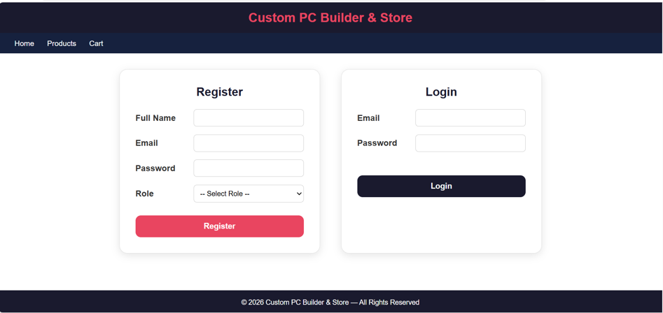
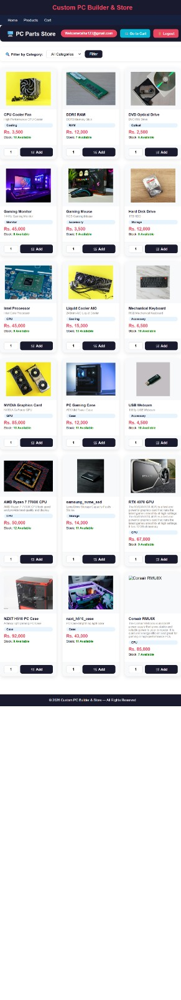
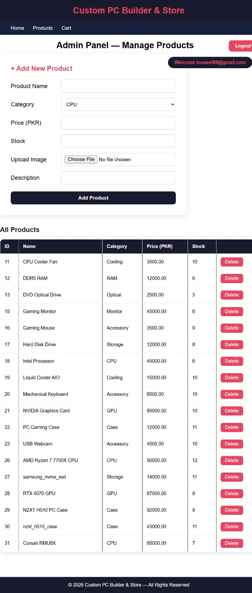
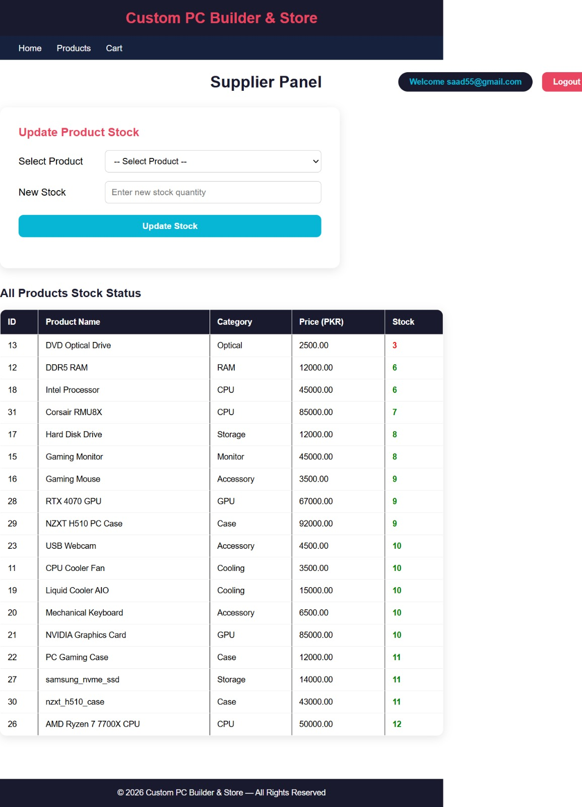
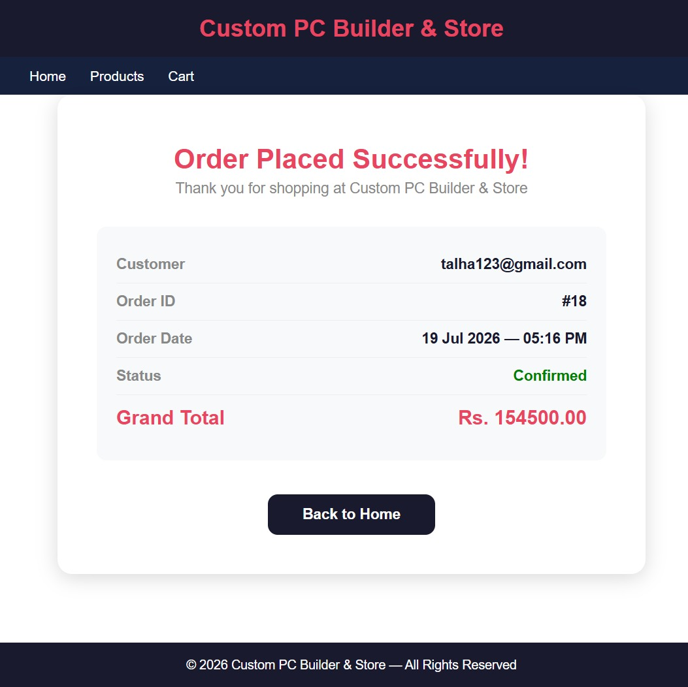
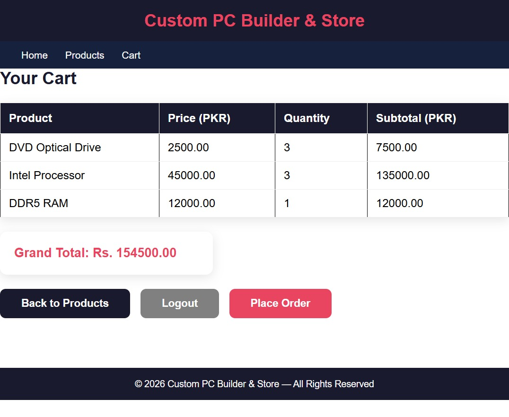

# Custom PC Builder and Store

## Description

This is a Custom PC Builder and Store developed using ASP.NET Web Forms, C# and SQL Server. The project allows users to browse computer components, build a custom PC, manage a shopping cart, place orders and generate bills through a simple and user-friendly interface. It also includes Admin and Supplier panels for managing products, categories, inventory, suppliers and customer orders.

---

## Features

- User registration and login
- Browse computer products
- Build a custom PC
- Product category management
- Shopping cart
- Place customer orders
- Bill generation
- Admin panel
- Supplier panel
- Product and inventory management
- Customer order management
- SQL Server database integration

---

## Technologies Used

- ASP.NET Web Forms
- C#
- SQL Server
- ADO.NET
- HTML
- CSS
- JavaScript

---

## Screenshots

### Home Page

### Product Page

### Admin Panel

### Supplier Panel

### Order Page

### Shopping Cart

---

## Project Demo

Watch the project demo here:

[▶ Custom PC Builder and Store Demo](Demo/Custom-Pc-Builder-Store-Demo-Video.mp4)

---

## How to Run

1. Download or clone the repository.
2. Open the solution in Visual Studio.
3. Restore the SQL Server database.
4. Update the database connection string if needed.
5. Build and run the project.
6. Open the application in your web browser.

---

## Author

**Muhammad Talha**

Computer Science Student

---

## Thank You

Thank you for visiting this repository. I hope you find this project helpful.
